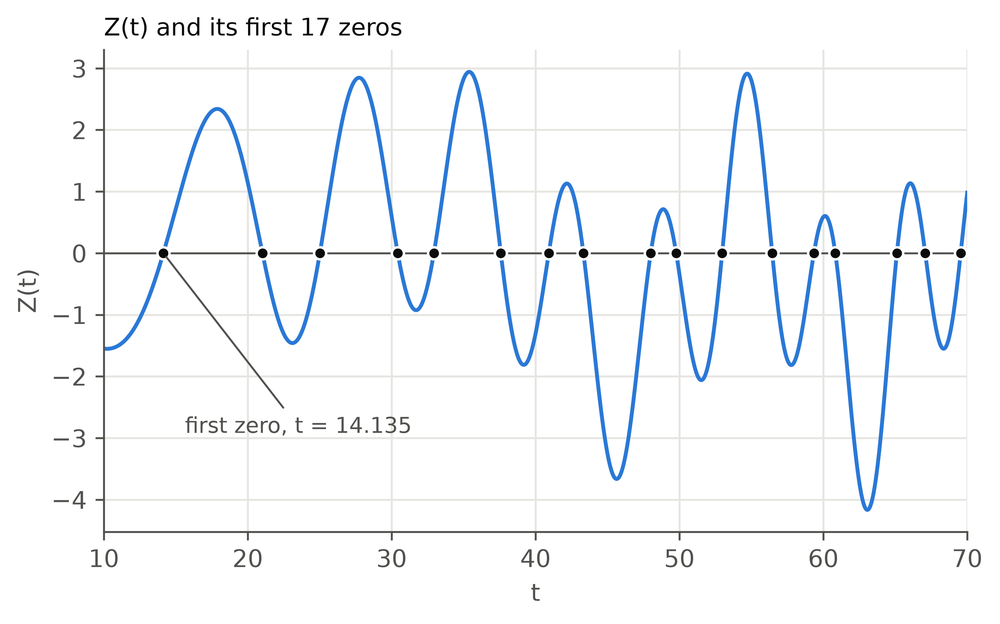
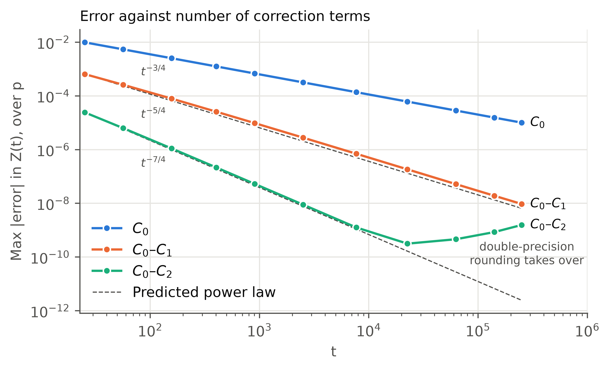
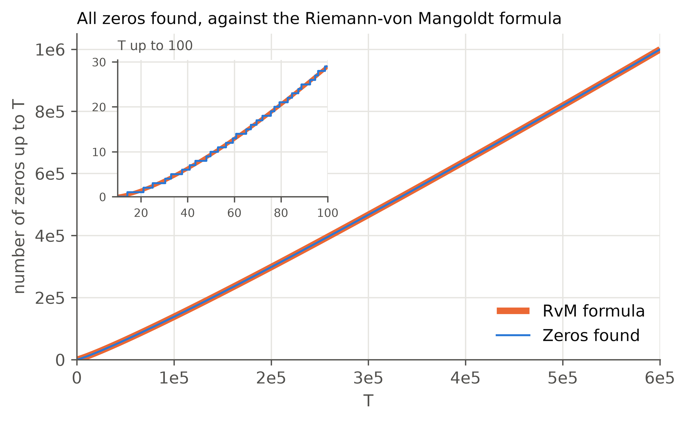
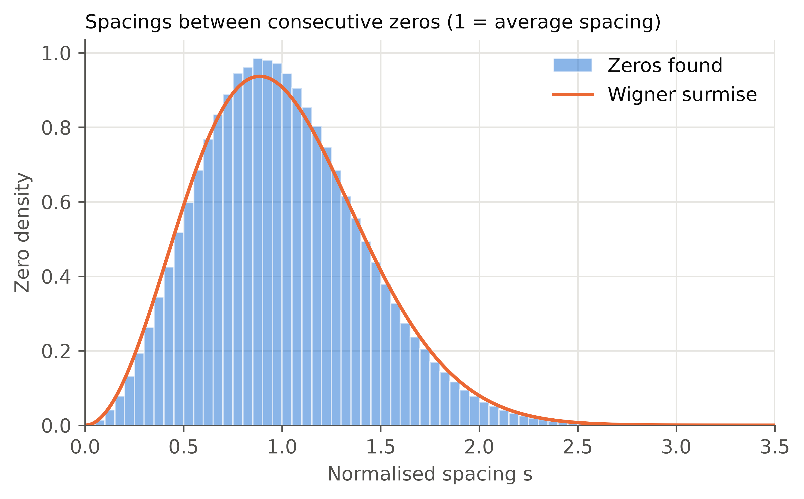

# Riemann–Siegel zeta zero finder

Finds zeros of ζ(1/2 + it) on the critical line using the Riemann–Siegel formula, in C++17. It also checks that no zeros were missed: by Gram-block counting at low height, and by Turing's method above t ≈ 528.

Work in progress: the short LaTeX note is not written yet (see Status).

## Build and run

Requirements: a C++17 compiler (`g++` or `clang++`) and `make`. Python (via Poetry, `poetry install`) is needed only for `make errors`, `make plots` and `make results`.

```
make                      # builds every program into build/
make run                  # first 20 zeros
make run N=400            # first 400 zeros
make test                 # sanity-check suite
make counts               # zero counts against Riemann-von Mangoldt (generates its own 200,000 zeros, ~30 s)
make errors               # error against number of correction terms, vs mpmath (needs: poetry install)
make timing               # wall-clock time of ./build/main for 10^3..10^5 zeros (P=6 adds 10^6, ~4 min)
make plots                # the figures, as PDF and PNG in figures/ (needs: poetry install and data/zeros.csv from make run N=1000000)
make results              # every headline number: first-10 errors, counts, correction-term errors, timing (~5 min)
make clean
```

Only `make run` writes `data/zeros.csv`; `make counts`, `make timing` and `make results` run `main` in `build/verify/` and leave it alone. `make run` calls `./build/main <targetCount>` and **overwrites `data/zeros.csv`**, but only if every check passes; on any failure `main` prints the reason and exits non-zero without writing it. `data/zeros.csv` is generated and git-ignored, so each run replaces it and nothing in git holds a previous version.

The scan step is a constant in `src/main.cpp` (`baseStep = 0.01`), not a command-line argument. Zeros are located block by block between consecutive good Gram points. If a block's bracket count differs from the number of zeros it must hold (for example, two zeros closer together than the step give no sign change), the block is rescanned at a step ten times smaller, down to 10^-6, and `main` fails if no step matches.

### Output

`data/zeros.csv` has one row per zero, `n,t`, with t to 12 significant figures.

`main` prints a completeness report. For `make run N=400`:

```
Turing certification on n=289..399: proven (110 zeros)
Found 400 zeros up to Gram point n=399, written to data/zeros.csv
```

What it means:

- **Every Gram block matched its expected count.** The scan found, in every block from n = 0 up to the last Gram point used, as many sign changes of Z(t) as the block's length requires. Below Turing's threshold this is a count check, not a proof.
- **Turing certification (proven, with caveats below).** For Gram points n = 289 up to the printed value, the zero count is proven at both ends of the span (`findProvableSpan`), and the scan found exactly that many sign changes in between. Using N(g_n) = n + 1, the count check covers zeros 1-290 and the Turing span covers zeros 291 onwards.
- If every requested zero is below the Turing threshold, the report says so and nothing is certified.
- On any failure (a block that cannot be matched, an endpoint that cannot be proven, or a count that differs from the proven one), `main` prints the reason to stderr and exits non-zero without writing the CSV.

Measured on one core (`-O2`, `make timing P=6`): 10^3, 10^4, 10^5 and 10^6 zeros took 0.05 s, 0.53 s, 10.6 s and 256 s, with time / T^1.5 roughly constant (about 5 x 10^-7), so the cost grows like T^(3/2). The 10^6 run was proven; the CSV had 1,000,000 consecutive rows with the last at t = 600269.677012. A first version with a fixed 0.01 scan reported NOT proven at this size because it missed a close pair of zeros near t = 273193.66 (gap 0.0057); the rescan fixes that.

## Method

With N = ⌊√(t/2π)⌋ and p = √(t/2π) − N:

```
Z(t) = 2 Σ_{n=1}^{N} cos(θ(t) − t ln n) / √n + (−1)^{N−1} (2π/t)^{1/4} Σ_k C_k(p) (2π/t)^{k/2}
```

Z is real, and its sign changes are zeros of ζ on the critical line.

- θ(t) uses the Stirling series for arg Γ(1/4 + it/2) − (t/2) ln π, with two correction terms.
- C₀(p) = cos(2π(p² − p − 1/16)) / cos(2πp), exactly. C₁ and C₂ are derived as scaled derivatives of C₀ (Berry 1995). C₃ and later are not used.
- C₁ and C₂ have removable singularities at p = 1/4 and 3/4 where the direct formula suffers catastrophic cancellation. Near those points, local Taylor expansions are used instead (`src/correction_terms.hpp`).
- Zeros are located by scanning for sign changes, then bisection.
- A Gram point g_n is where θ(g_n) = nπ. Gram's Law says (−1)ⁿ Z(g_n) > 0; it fails (first at n = 126), so Gram blocks are used to count zeros across the failures.
- Turing's method bounds S(T) = N(T) − θ(T)/π − 1 using Turing's bound on ∫S(t)dt, valid for t > 168π ≈ 527.8. If the bound is below 2, then since S(g_m) is an even integer at a good Gram point, N(g_m) = m + 1 exactly.

## Accuracy

Stopping at C₂ limits accuracy. Measured against the published first 10 zeros (bisection, 50 iterations), the error ranges from 9.3 × 10⁻⁷ to 9.8 × 10⁻⁵, and is worst at the first zero:

| zero | refined      | known        | error     |
| ---- | ------------ | ------------ | --------- |
| 1    | 14.134822934 | 14.134725142 | 9.78e-05  |
| 2    | 21.022037184 | 21.022039639 | -2.46e-06 |
| 3    | 25.010871495 | 25.010857580 | 1.39e-05  |
| 4    | 30.424886536 | 30.424876126 | 1.04e-05  |
| 5    | 32.935044499 | 32.935061588 | -1.71e-05 |
| 6    | 37.586185510 | 37.586178159 | 7.35e-06  |
| 7    | 40.918717830 | 40.918719012 | -1.18e-06 |
| 8    | 43.327071052 | 43.327073281 | -2.23e-06 |
| 9    | 48.005153495 | 48.005150881 | 2.61e-06  |
| 10   | 49.773831545 | 49.773832478 | -9.33e-07 |

So zero locations are good to roughly 4–6 decimal places, not 8. This is the cost of a deliberate scope decision (C₀–C₂ only), not a bug. The error is largest at low t. The first omitted term scales as t^(−7/4); the measured slope is −1.72 (see Results), but the error has not been compared with a rigorous remainder bound (Gabcke's), which has not been read.

## Results

All figures are regenerated by `make plots` (it reads `data/zeros.csv` from `make run N=1000000` and never writes it). The PDFs used by the LaTeX note are in `figures/` next to these PNGs.

### Z(t) and its zeros



Z(t) from the production `z(t)` for t = 10 to 70, with the first 17 zeros from the zero finder marked.

### Error against number of correction terms



Worst-case error of Z(t) over p, against `mpmath.siegelz` (25 digits), with C₀ only, C₀–C₁ and C₀–C₂, at 11 heights from t = 25 to 2.5 × 10⁵ and 100 values of p each. The dashed lines are the predicted power laws, t^(−3/4), t^(−5/4) and t^(−7/4), from the first omitted term; each is anchored at its series' first point, so only the slope is a prediction. Fitted slopes are −0.75, −1.22 and −1.72. The C₀–C₂ fit uses only the six heights with error above 5 × 10⁻⁹, a cutoff chosen after seeing where the error stops falling.

Above t ≈ 2 × 10⁴ the C₀–C₂ error rises again (1.6 × 10⁻⁹ at t = 2.5 × 10⁵). This is attributed to double-precision rounding of the phase, which is inferred from how it grows with t and has not been isolated. The reference is not independent of the method: `mpmath` uses its own Riemann–Siegel routine at large t, so it is independent of this code's truncation, coefficients and double precision only. `make errors` prints the full table.

### Zero counts



The zeros found up to T against the Riemann–von Mangoldt formula, N(T) ≈ (T/2π) ln(T/2π) − T/2π + 7/8. At this scale the two curves coincide (the formula is drawn thick underneath); the inset shows the steps for T up to 100. `make counts` prints the numbers:

| T      | counted | smooth     | counted − smooth |
| ------ | ------- | ---------- | ---------------- |
| 100    | 29      | 29.0023    | −0.0023          |
| 1000   | 649     | 648.6162   | 0.3838           |
| 10000  | 10142   | 10142.9653 | −0.9653          |
| 100000 | 138069  | 138068.5584 | 0.4416          |

N(T) = θ(T)/π + 1 + S(T), so `counted − smooth` equals S(T) up to the O(1/T) remainder. This is consistent with no missed zeros, but above t ≈ 528 it is not independent of the Turing proof.

### Spacings between zeros



The gap between each pair of consecutive zeros, divided by the local mean spacing 2π/ln(t/2π), so that 1 means an average gap. The orange curve is the Wigner surmise for the Gaussian unitary ensemble, p(s) = (32/π²) s² exp(−4s²/π) (Wikipedia, "Wigner surmise"; checked numerically: it integrates to 1 with mean 1). `make plots` prints the summary: 999,999 gaps, mean 1.0000, standard deviation 0.4063 against 0.4220 for the surmise. The zeros at these heights are slightly more regular than the surmise; it is an approximation to the exact distribution, which was not compared.

The two smallest spacings are 0.0097 at t = 273193.67 (raw gap 0.00570, between zeros 273193.663138 and 273193.668841) and 0.0122 at t = 511464.90 (raw gap 0.00681). A fixed scan step of 0.01 can miss pairs this close (if no sample falls between the two zeros, there is no sign change). The first run for 10⁶ zeros missed the first of them, and the other lies inside the second window where that run came up two zeros short (n = 800291 to 850291; that miss was not located individually). This is why `main` rescans any block whose count is wrong.

## Limits of the completeness checks

- Zeros 1–290 (t below about 528) are checked by counting only. Turing's bound is not valid there. Backlund's method covers that range rigorously (done historically to T = 200, then 300.468 by Hutchinson) but needs ζ off the critical line and is not implemented.
- The Turing result is conditional on the computed signs of Z being correct. Z is evaluated in double precision with C₀–C₂, and the proof uses no interval arithmetic or rigorous remainder bound. It is not a machine-checked proof.
- `turingBound` uses the constants in Pugh (2.30 + 0.128 log(t/2π)). Trudgian quotes Turing's constant as 2.07; the difference is unexplained. Pugh's is the weaker, so it is still safe if Turing's bound holds.

## Layout

| path                       | contents                                                                        |
| -------------------------- | ------------------------------------------------------------------------------- |
| `src/rs.hpp`               | `theta`, `zMain`, `z`, `findSignChanges`, `bisect`, `estimateTMax`              |
| `src/correction_terms.hpp` | `c0`, `c1`, `c2`, and the Taylor expansions near the singularities              |
| `src/gram.hpp`             | Gram points, Gram's Law, Gram blocks, `scanBlock`                               |
| `src/turing.hpp`           | Turing's method: `proveSpan`, `proveCompleteSpan` and helpers                   |
| `src/csv_export.hpp`       | `writeZerosCSV`                                                                 |
| `src/main.cpp`             | command-line program                                                            |
| `src/verify/tests.cpp`     | sanity checks, printed next to their expected values (no assertions)            |
| `src/verify/counts.cpp`    | zero counts in `data/zeros.csv` against Riemann–von Mangoldt                    |
| `src/verify/errors.cpp`    | writes `data/term_errors.csv`: Z(t) with 1, 2 and 3 correction terms            |
| `src/verify/zcurve.cpp`    | writes `data/z_curve.csv`, Z(t) from the production `z`, for the first figure  |
| `src/verify/timing.sh`     | times `./build/main` for 10^3 .. 10^P zeros from outside, checks time / T^1.5   |
| `plots/term_errors.py`     | compares `data/term_errors.csv` with `mpmath.siegelz`, fits the error slopes    |
| `plots/plot.py`            | the figures in `figures/` (PDF and PNG), reading `data/zeros.csv`               |
| `figures/`                 | generated figures, tracked in git                                               |
| `data/`                    | generated CSV output, git-ignored                                               |

## Status

Done: the Riemann–Siegel evaluation with C₀–C₂, zero finding, Gram blocks and Turing's method, and the verification suite (`make results`: first-10-zero errors, counts against Riemann–von Mangoldt, error against number of correction terms, timing), and the four figures (`make plots`).

Not done: the short LaTeX note, the comparison with Gabcke's remainder bound, and a fresh-clone build check.

## References

- M. V. Berry (1995), "The Riemann–Siegel expansion for the zeta function: high orders and remainders", Proc. R. Soc. Lond. A 450, 439–462. Source of C₁ and C₂ as derivatives of C₀.
- G. R. Pugh (1998), "The Riemann–Siegel Formula and Large Scale Computations of the Riemann Zeta Function", MSc thesis, University of British Columbia. Source of the formula structure, Gram's Law, and Turing's method as implemented here (§4.1–4.3).
- T. S. Trudgian (2010), "Improvements to Turing's Method", Math. Comp. (introduction and Theorem 2.2 read). Source of the historical small-t methods and the 168π threshold.
- Wikipedia, "Riemann–Siegel theta function" and "Gram point". Source of θ's correction terms and the first Gram point used as a check.
- Wikipedia, "Wigner surmise". Source of the GUE spacing formula in the spacings figure.
- mpmath 1.4.1, `siegelz`: the high-precision reference for the correction-term error experiment.
